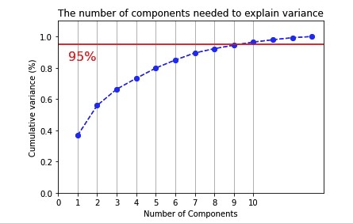

# PCA

## Dane
Plik z danymi zawiera informacje o roznych cechach wina. Wystepuje 13 zmiennych objasniajacych oraz zmienna objasniana kategoryczna z 3 klasami.
Dane zostaly pobrane z serwisu kaggle.com

## Informacje
Celem projektu jest zbudowanie klasyfikatora, rozrozniajacego poszczegolne rodzaje wina. Klasyfikacja jest poprzedzona redukcja wymiarow,
do tego stopnia by nie tracic zbyt wielu informacji (95% wariancji), porownana jest takze skutecznosc klasyfikacji bez redukcji wymiarow oraz
po zastosowaniu.
Kod napisany w 2022 r. w języku Python 3.

## Pliki
- Wine.csv - plik z danymi
- PCA.py - kod

## Przykladowe rezultaty dzialania programu

